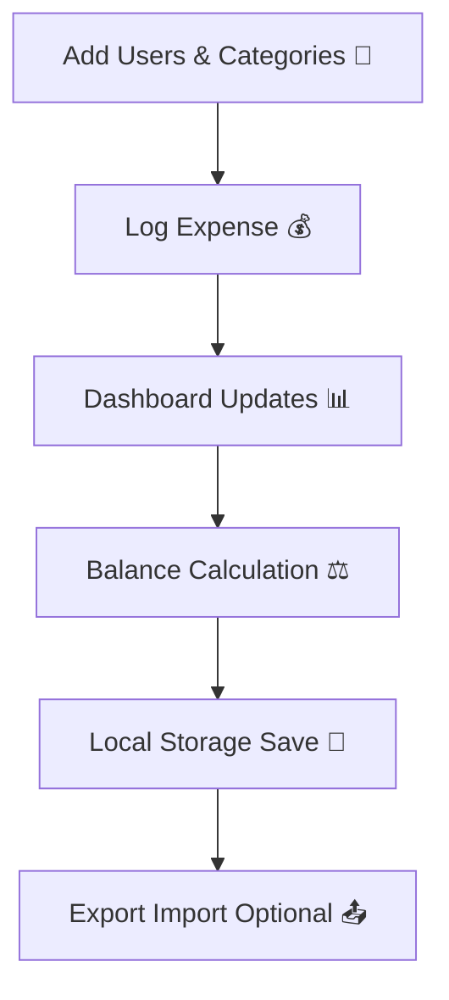

# 💰 Penny – Smart Group Expense Manager 🎯

🔗 **Open-Source | Free Forever | Privacy-First** 🔗

---

## ✨ About Penny 🌟

**Penny** is a next-gen **group shared expense manager** 📊 that makes splitting bills and managing group finances effortless! 🚀

Unlike traditional apps that hide features behind a paywall or compromise your privacy, Penny is:
- 🚫 **Free forever** – no premium subscriptions, no hidden charges 💸
- 🔒 **Privacy-first** – all data is processed locally on your device 📱
- ⚡ **Lightweight** – runs smoothly on budget devices without draining resources 🔋
- 📊 **Feature-rich** – intuitive dashboards, analytics, and offline persistence 📈

Built with [Flutter](https://flutter.dev/) 🦋, Penny works seamlessly on both **Android** 🤖 and **iOS** 🍎.

---

## 🆚 Why Penny vs Splitwise? 🤔

| Feature | **Penny (Ours)** 🏆 | **Splitwise** 📱 |
|---------|------------------|----------------|
| 💸 Cost | **Completely Free** ✅ | Free + Premium ($3/month) 💳 |
| 🔒 Privacy | 100% Offline (Local Storage) 🏠 | Requires Cloud Account ☁️ |
| 📊 Predictions | On-device ML (lightweight) 🤖 | Cloud-based 🌐 |
| 📤 Data Export | JSON + Excel anytime 📋 | Limited free export ⛔ |
| 🛠️ Customization | Open-source, community-driven 👥 | Closed-source 🔐 |
| 🚀 Performance | Lightweight, no server dependency ⚡ | Heavier, internet required 📶 |
| 🎯 Audience | Students, roommates, families 👨‍👩‍👧‍👦 | Professionals / Mixed 💼 |

👉 **In short:** Penny delivers **everything Splitwise does** – but free, open, and private! 🎉

---

## 🚀 Core Features 💪

- ➕ Add and manage multiple **users** 👥 and **categories** 📂
- 📊 Track **group expenses** with real-time balances ⚖️
- ✏️ Edit and delete records effortlessly 🗑️
- 📤 Export / 📥 Import data (JSON, Excel) 💾
- 🔒 Persistent offline storage 📱
- ⚖️ Handles **unequal expense shares** 🍕
- 📈 Visual insights with charts and summaries 📊
- 🌍 Works **completely offline** with no login required 🔓

---

## 📱 Usage Guide 📖

1. ➕ **Add Users & Categories** in the settings panel ⚙️
2. 🧾 **Log Expenses** with the ➕ button 💰
3. 📋 **View & Edit Records** in the Log page 📝
4. ⚖️ **Check Balances** on the Shares page 💳
5. 💾 **Backup or Restore** anytime with Export/Import 🔄

---

## 🔄 System Flow 🎯



This ensures **simplicity, transparency, and privacy-first storage**! 🔒✨

---

## 🏗️ Architecture Overview 🏛️

Here's how Penny is structured internally: 🧩

```plaintext
+-----------------------+
|        UI Layer 🎨    |
|  (Screens & Widgets)  |
+----------+------------+
           |
           v
+-----------------------+
|     Service Layer ⚙️  |
| (Expense logic, ML,   |
|  storage management)  |
+----------+------------+
           |
           v
+-----------------------+
|   Data Layer (Local) 💾|
|   JSON / SQLite DB    |
+-----------------------+
```

* **UI Layer** 🎨 → Flutter widgets/screens for expenses, logs, shares
* **Service Layer** ⚙️ → Business logic, calculations, predictions, validation
* **Data Layer** 💾 → Offline persistence with JSON/SQLite, export/import support

---

## 🛣️ Roadmap / Upcoming Releases 🗓️

* [ ] 🔍 Search functionality in expense logs 🕵️
* [ ] 🔐 Optional Firebase authentication for multi-device sync 🔄
* [ ] 🌍 Multi-language support 🗣️
* [ ] 🎨 UI theming support (dark/light/custom colors) 🌙☀️
* [ ] 🤖 Smart suggestions (predict recurring expenses) 🧠
* [ ] 📊 Advanced analytics with predictive charts 📈
* [ ] 📱 iOS App Store release 🍎
* [ ] 📦 Package releases on `pub.dev` 📚
* [ ] 🔗 Integrations (Google Drive/Dropbox backup) ☁️
* [x] 📅 Monthly expense grouping ✅
* [x] 💾 Reliable offline persistence ✅
* [x] 🚀 First production-ready release ✅

---

## 🤝 Contributing 💪

We ❤️ contributions! If you'd like to improve Penny, here's how you can help: 🙌

### 🛠️ Pull Request Guidelines 📋

1. Fork the repository 🍴
2. Create a new branch: 🌿

   ```bash
   git checkout -b feature/your-feature-name
   ```

3. Commit your changes with clear messages: 💬

   ```bash
   git commit -m "Add: New feature for expense filtering 🔍"
   ```

4. Push to your branch: 📤

   ```bash
   git push origin feature/your-feature-name
   ```

5. Open a **Pull Request** (PR) against the `main` branch 📨

### ✅ Code of Conduct 📜

* Keep contributions respectful and constructive 🤝
* Write clean, modular, and well-documented code 📝
* Ensure features respect **privacy-first principles** 🔒
* Test thoroughly before submitting a PR 🧪

---

## 📖 Project Structure 🗂️

```plaintext
Penny/ 📁
├── assets/ 🎨
│   ├── icons/         # App icons and vector assets 🖼️
│   └── data/          # Sample JSON/Excel files 📊
├── lib/ 📚
│   ├── models/        # Data models (User, Expense, Category) 🏗️
│   ├── services/      # Local storage, ML predictions ⚙️
│   ├── ui/            # Screens and widgets 🎨
│   └── main.dart      # Entry point 🚀
├── test/ 🧪           # Unit and widget tests
└── README.md 📖       # This file
```

---

## 🗣️ Community & Discussions 💬

We want Penny to grow **with the community**! 🌱

* 🐛 **Found a bug?** → Open an issue 📝
* 💡 **Have an idea?** → Share in discussions or open a feature request 🚀
* 🧑‍💻 **Want to code?** → Fork the repo and send a PR 💻
* 🌍 **Non-coders?** → Help with documentation, translations, or spreading the word 📢

Your feedback shapes the roadmap! 🗺️✨

---

## ❓ Frequently Asked Questions (FAQ) 🤔

### 🌐 Does Penny need internet?
**Nope!** 🚫 Penny works **100% offline**. All your data stays on your device 📱.

### 📱 Can I use it on multiple devices?
Currently, data is stored locally per device 📲. Multi-device sync is on our roadmap! 🗓️

### 💾 How do I backup my data?
Use the **Export** feature 📤 to save your data as JSON or Excel files. You can then import them later! 📥

### 🔒 Is my data secure?
Absolutely! 🛡️ Since everything is stored locally, your financial data never leaves your device 🏠.

### 💸 Will Penny always be free?
**Yes!** 💚 Penny will always be completely free and open-source. No premium features, no subscriptions! 🚫💳

### 🐛 I found a bug. What should I do?
Please report it on our GitHub issues page! 🐛📝 We appreciate your help in making Penny better 💪.

---

## 📄 License 📜

This project is licensed under the [MIT License](https://github.com/mojjjeeed/hacathon/blob/main/LICENSE) 📋.

---

## 🌟 Support 💝

If Penny helps you, don't forget to **⭐ star the repo** and share it with your friends! 🎉📢

Made with 💚 by open-source contributors 👥.

---

### 🚀 Ready to get started? Download Penny now! 📲✨
